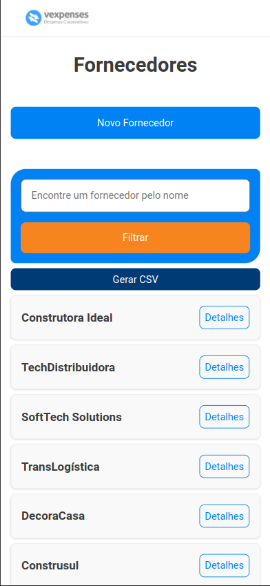
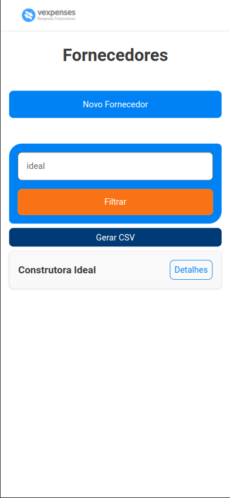
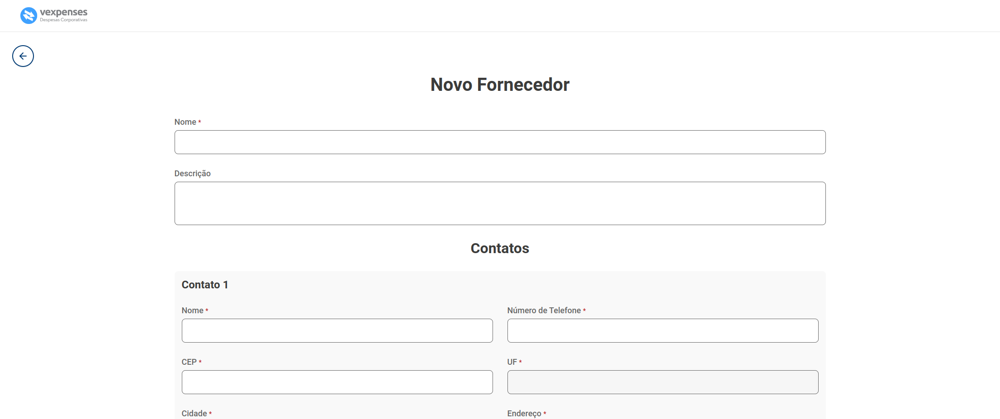
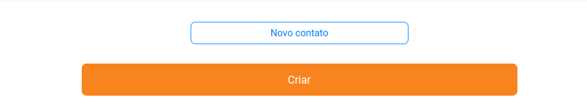
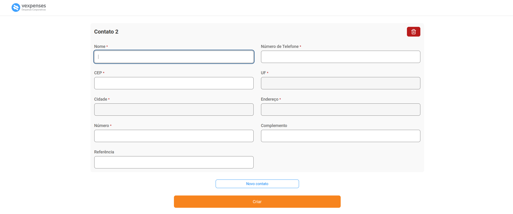
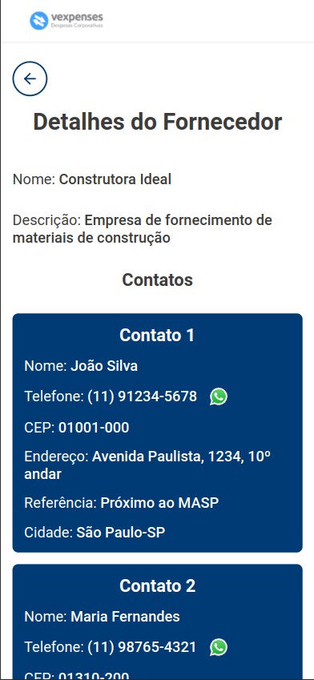
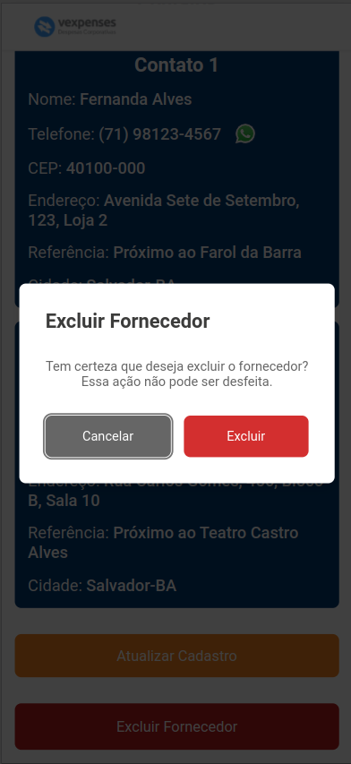

## Índice

- [Funcionalidades](#funcionalidades)
- [Funcionalidades Técnicas](#funcionalidades-técnicas)
- [Experiência do usuário](#experiência-do-usuário)
- [Tecnologias Utilizadas](#tecnologias-utilizadas)
- [Instalação e Execução](#instalação-e-execução)
  - [Instalação](#instalação)
- [Futuras Implementações](#futuras-implementações)
- [Contato](#contato)
- [Avisos Legais](#avisos-legais)

---

<div align="center">
  
</div>

###


Tenha seus fornecedores organizados na palma da mão, com o **Gerenciador de Fornecedores** da **Vexpenses**!

<div align="center">
  
</div>

---

## Funcionalidades

- **Filtro inteligente e download .csv**: Na tela inicial, você tem a opção de encontrar o fornecedor que deseja filtrando pelo nome, facilitando sua organização. Além disso, você ainda tem a opção de baixar a busca selecionada ou todas as empresas por csv, gerando relatórios detalhados sobre os detalhes de cada fornecedor

<div align="center">
  
</div>

---

- **Crie rapidamente um fornecedor**: Na tela de criação de fornecedor, você pode rapidamente inserir um novo fornecedor na sua base de dados, com os contatos mais relevantes da empresa.

<div align="center">
  
</div>

###

Adicione ainda quantos contatos quiser clicando no botão "Novo Contato" ao final da página.

<div align="center">
  
</div>

###

Para remover um contato também é super fácil. Basta você clicar no botão de excluir na seção de adicionar um novo contato. Porém se atente a um detalhe, essa opção só é liberada quando você possuir mais de um contato, pois por padrão todo novo fornecedor adicionado na base de dados precisa ter pelo menos um contato vinculado.

<div align="center">
  
</div>

---

- **Detalhes do Fornecedor**: Após clicar no botão de detalhes do fornecedor na tela inicial, você será redirecionado para a página onde contém todas as informações do fornecedor e os contatos mais relevantes, onde em cada contato há um botão para iniciar uma conversa de forma fácil no **Whatsapp**.

<div align="center">
  
</div>

---

- **Editar ou excluir o fornecedor**: Ainda na tela de detalhes do fornecedor, caso você precise alterar algum dado ou contato, pode facilmente ir para a tela de edição do fornecedor. clicando no botão **Atualizar cadastro**. Se você não precisar mais do fornecedor salvo na base de dados, pode removê-lo clicando no botão **Excluir Fornecedor**, mas certeza dessa ação, pois o fornecedor é excluído permanentemente da base de dados.

<div align="center">
  
</div>

###

## Funcionalidades Técnicas

### Tela inicial e Detalhes do Fornecedor
- É possível visualizar, criar, editar e excluir um fornecedor.
- É possível realizar o filtro pelo nome do fornecedor e exportar lista ativa na tela em um arquivo .csv.
- Cada fornecedor é exibido apenas com o nome e o botão de detalhes, que ao ser clicado redireciona o usuário para a tela de detalhes do fornecedor.
- A tela de usuário possui todas as informações do fornecedor e seus contatos, sendo cada card referente a um contato.
- Para cada contato, há um botão com o ícone do whatsapp, que ao clicado redireciona o usuário para uma nova conversa do whatsapp em uma nova aba do browser.
- Abaixo dos contatos possui um botão de Atualizar Cadastro que redireciona o usuário para a tela de edição e um botão de excluir cadastro que abre um modal de confirmação. Ao usuário confirmar a exclusão do contato, ele é redirecionado para a tela inicial e é exibido um toast de sucesso.

### Criação e edição de contato
- É possível adicionar ou remover quantos contatos quiser, porém o botão de excluir um contato só é habilitado a partir do segundo contato, sendo pelo menos um contato sempre obrigatório.
- Os inputs de endereço, cidade e estado são desabilitados, e para serem preenchidos, o usuário deve digitar o CEP e é feito uma busca na api viacep para validar se existe um endereço válido para o cep digitado
- Ao entrar na tela pelo modo de edição, todos os inputs são automaticamente preenchidos com os dados do usuário.
- Todos os inputs obrigatórios possuem validação por regex.

---

## Experiência do usuário.

### Pensando nas melhores práticas de usabilide, foram implementadas algumas funcionalidades pensando no melhor uso da plataforma:
- Todas as telas estão responsivas para celular, tablet e desktop.
- A tela inicial, tela de detalhes do usuário e tela de edição do usuário possuem skeleton loadings ao entrar na página.
- Todos os botões que envolvem ações assíncronas possuem estado de loading e disabled para evitar que o usuário clique de novo enquanto uma ação assíncrona está ocorrendo.
- Ao entrar numa página não listada na aplicação, o usuário é redirecionado para uma página Not Found.
- Ao entrar nas telas de detalhes ou edição do usuário com um ID inexistente, após o loading o usuário também é redirecionado para a tela de Not found, e os botões de ação não são renderizados durante o loading, evitando que ele tente executar alguma ação para um id inexistente.
- Todas as telas exibem toasts para ações de sucesso ou erro.
- Todas as telas possuem validação visual de erros para api fora do ar ou algum retorno de erro, assim o usuário tem detalhes do que está acontecendo e evita da aplicação quebrar.
- Todas as telas tem acessibilidade para navegação por teclado, sendo cada input ou botão estilizado com outline, focus e hover de cor individual, facilitando na navegação do usuário.
- Filtro de fornecedor salvo em URL State, para o link ser compartilhado sem perder o filtro ativo.

## Tecnologias Utilizadas
- [React](https://react.dev/)
- [TypeScript](https://www.typescriptlang.org/)
- [Styled Components](https://styled-components.com/)
- [React Router](https://reactrouter.com/en/main)
- [React Hook Form](https://react-hook-form.com/)
- [@hookform/resolvers](https://github.com/react-hook-form/resolvers)
- [@tanstack/react-query](https://tanstack.com/query/v5)
- [axios](https://axios-http.com/)
- [lucide-react](https://lucide.dev/)
- [react-hot-toast](https://react-hot-toast.com/)
- [react-loading-skeleton](https://github.com/dvtng/react-loading-skeleton)
- [use-mask-input](https://github.com/eduardoborges/use-mask-input)
- [yup](https://github.com/jquense/yup)
- [@radix-ui/react-dialog](https://www.radix-ui.com/docs/primitives/components/dialog)
- [papaparse](https://www.papaparse.com/)
- [Vite](https://vitejs.dev/)
- [ESLint](https://eslint.org/)
- [json-server](https://github.com/typicode/json-server)

---

## Instalação e Execução

Antes de começar, certifique-se de ter as seguintes ferramentas instaladas em seu sistema:

- [Node.js](https://nodejs.org/) (versão 18 ou superior, para esse projeto eu utilizei a versão 20.14.0)
- [npm](https://www.npmjs.com/) ou [Yarn](https://classic.yarnpkg.com/) (gerenciador de pacotes)

## Instalação

1. **Clone o Repositório**

   Se ainda não tiver o repositório clonado, faça isso com o comando:

- HTTPS:
   ```bash
   git clone https://github.com/edu-almeidaf/crud-fornecedores.git
   ```

- SSH:
   ```bash
   git clone git@github.com:edu-almeidaf/crud-fornecedores.git
   ```
##

2. **Navegue até o diretório do projeto**
   ```bash
   cd crud-fornecedores
   ```
##

3. **Instale as dependências**

    Você pode instalar as dependências usando npm ou yarn:
- npm:
    ```bash
    npm install
    ```
- yarn:
    ```bash
    yarn install
    ```
##

4. **Inicie o servidor**

    Esse projeto utiliza um servidor com local com o JSON server, então você precisa rodá-lo antes para o projeto funcionar.
- npm:
    ```bash
    npm run dev:server
    ```
- yarn:
    ```bash
    yarn dev:server
    ```

5. **Abra um novo terminal e rode o projeto**
- npm:
    ```bash
    npm run dev
    ```
- yarn:
    ```bash
    yarn dev
    ```

## Avisos:
- Caso opte por rodar o projeto com Yarn, remova o arquivo package-lock.json. Isso garantirá que o arquivo yarn.lock seja utilizado corretamente

- Esse projeto roda na porta **5173**. Caso já tenha outro serviço rodando nesta porta, pode facilmente substituir a porta dentro do arquivo `vite.config.ts`. Para isso, basta adicionar a chave `server` conforme o exemplo abaixo:

  ```ts
  import { defineConfig } from 'vite'
  import path from 'path'
  import react from '@vitejs/plugin-react'

  // https://vitejs.dev/config/
  export default defineConfig({
    plugins: [react()],
    resolve: {
      alias: {
        '@': path.resolve(__dirname, './src'),
      },
    },
    server: {
      port: 5173 //Número da porta desejada
    }
  })
  ```
---

## Futuras Implementações

- **Testes Automatizados**: Implementar testes automatizados com a biblioteca Vitest para garantir a qualidade do código.
- **Integração com Backend**: Atualmente o projeto não possui backend dedicado, futuramente pretendo transformar essa aplicação em um projeto fullstack com o backend em Node.js com Fastify.
- **Autenticação de Usuário**: Implementar um sistema de login e criação de usuário.
- **Integração com Google Maps**: Confirmar o endereço do usuário com um mapa na tela, semelhante a alguns serviços utilizados em grandes empresas, como a criação de endereço no **Mercado Livre**

---

## Contato

Se você tiver dúvidas ou sugestões, entre em contato:

- Email: [eduardoa.fernandes@hotmail.com](mailto:eduardoa.fernandes@hotmail.com)
- LinkedIn: [Eduardo de Almeida Fernandes](https://linkedin.com/in/almeidaedu)

---

## Avisos Legais

Este projeto foi desenvolvido com o intuito de aprendizado e aprimoramento das minhas habilidades. As marcas e logos mencionadas são de propriedade de seus respectivos donos e são utilizadas apenas como referência.